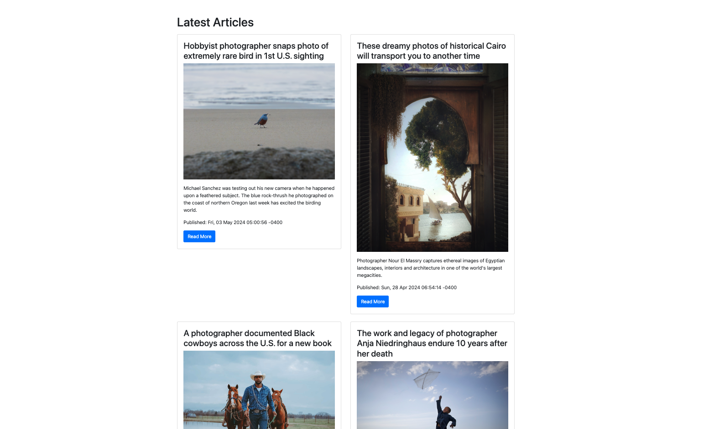

# News Aggregator



This is a simple web application built with Python Flask that aggregates news articles from an RSS feed and displays them on a webpage. All code was generated using ChatGPT and the prompts defined in the prompts_history.txt file within this repo. 

## Features

- Fetches articles from a RSS feed.
- Displays articles in a paginated format with Bootstrap pagination.
- Each article is displayed in a Bootstrap card with hover and shadow effects.
- Provides error handling for failed RSS feed requests.

## Installation

1. Clone the repository:

    ```
    git clone https://github.com/your-username/genai_infofeed.git
    ```

2. Install the required Python packages:

    ```
    pip install -r requirements.txt
    ```

3. Run the Flask application:

    ```
    python app.py
    ```

4. Open your web browser and navigate to `http://localhost:5000` to view the application.

## Usage

- Upon opening the application, you'll see the latest articles fetched from the configured RSS feed.
- Click on the pagination links at the bottom to navigate between pages of articles.

## Configuration

- You can configure the RSS feed to fetch articles from by modifying the `app.py` file.

## Technologies Used

- Python
- Flask
- Jinja2
- Feedparser
- BeautifulSoup
- Bootstrap
- Font Awesome

## License

This project is licensed under the MIT License - see the [LICENSE](LICENSE) file for details.

## Acknowledgements

- This project was inspired by [Python Development with ChatGPT: Fullstack App Development](https://www.coursera.org/learn/python-development-with-chatgpt-fullstack-app-development/home/) and utilizes various open-source libraries and frameworks.